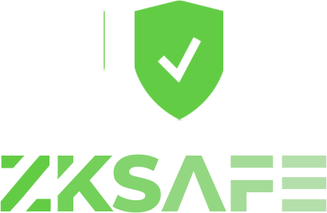
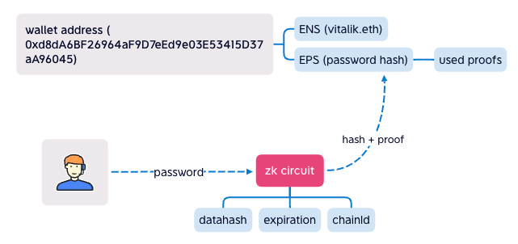
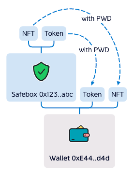

 
 

## Ethereum Password Service
#### EPS contract binding password hash to wallet address.
 

 

### How it works

User input password to EPS ZK Circuit (running at frontend), it output hash + proof, it proving that the hash is generate from the password, EPS contract can verify it, if the hash equals the one binging in EPS contract, that means the user input the right password.

Advanced, used proofs is recorded in EPS contract, to avoid Double Spent. 
And, datahash\expiration\chainId are added to ZK Circuit, make (ZK) Password to sign data as PrivateKey.

 
 

## Safebox
#### If privatekey is stolen, Safebox is still safe.
 

 

### How it works

Safebox is a Smart Contract Wallet, deployed by user. 

User holds Wallet, Wallet holds Safebox, Safebox holds Assets.

Withdraw from Safebox need the ZK Password. 
The withdraw to-address must be Safebox's owner. 
The caller must be Safebox's owner.

 
 

## FAQ
<ul>
<li>Where is the password store?

In your mind.

</li>
<li>If the project fail or be hacked, is my Safebox safe?

Yes, the Safebox is Smart Contract Wallet, you're the only owner of the contract, it's running forever and no one can control it except you.

</li>
</ul>
 
 

## Hackthon & Grant
#### 2022 BNBChain Hackthon 1st at DAO Track <a href="https://dorahacks.io/bnb/1/top">zkPayroll</a>
#### 2022 ETHShanghai Hackathon Sponser Track Winner <a href="https://gitcoin.co/hackathon/ethshanghai/projects/?org=abridged">zkSafebox</a>